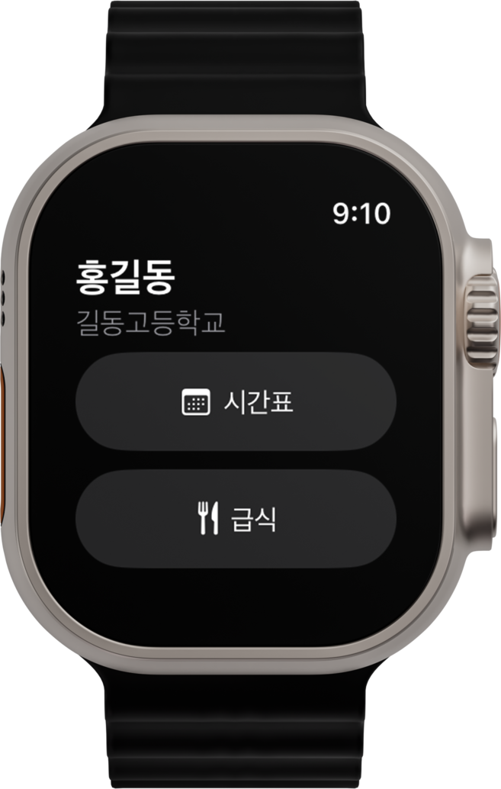

# Teacher Plan

국내 교사용 시간표 IOS(+ watchOS) 앱

> 컴시간 알리미를 지원하는 학교에서만 사용하실 수 있습니다.

## Tech Stack

### Frontend

### Backend

## Features

- 학교 검색
- 교사 목록 조회
- 교사 시간표 조회

## Screenshots

|  |  |
|-----------------------|-----------------------|

## Authors

- [@son-daehyeon](https://www.github.com/son-daehyeon)

## Acknowledgements

- [Comcigan API](https://github.com/son-daehyeon/Comcigan-API)
